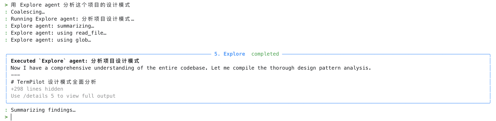
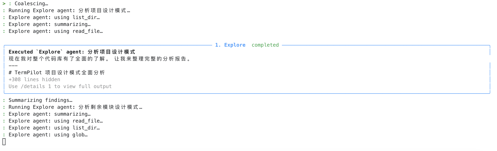
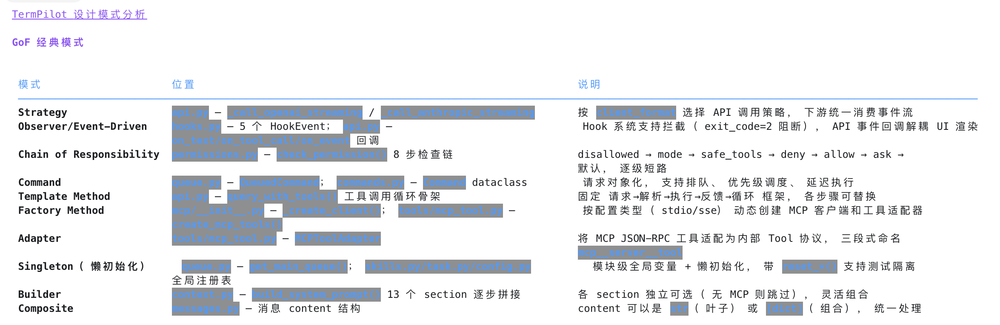
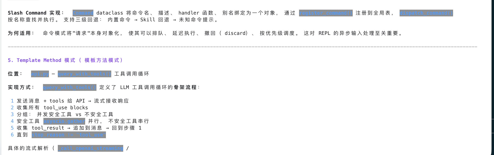
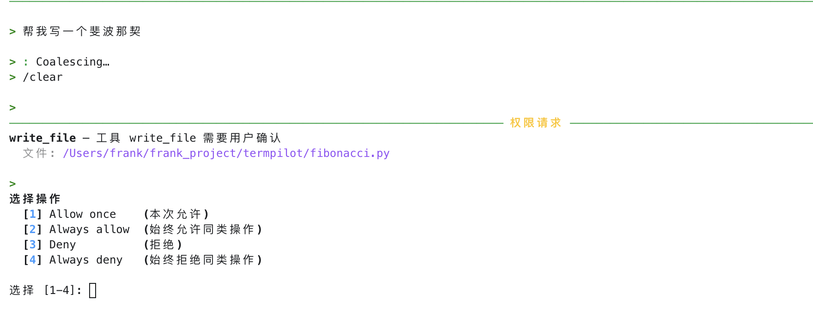
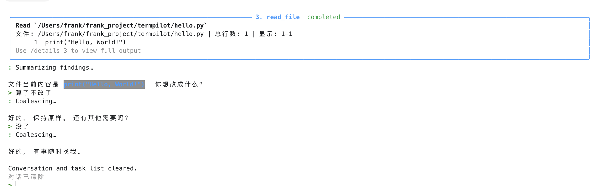

# Test Cases After Feature Optimization

## CASE-1: Agent Tool Triggering
Input: "Analyze the project design patterns", verify Explore agent is triggered
### Before Improvement
Reading and analyzing large projects took a long time, appearing stuck at "Running Explore agent..."
Results would suddenly appear after a long wait, and the output was not concise enough. Then entering the `/details` command would display details rather abruptly, as shown below.
It took several minutes after input before the following results appeared.

### After Improvement
As shown below, sub-agents now report status back progressively, providing incremental progress output and improving user experience.

**Returned module summary list (partial screenshots):**

**Partial screenshots from /details response:**

## CASE-2: Batch Agent
Input: "Check the main functionality of cli.py, api.py, and context.py respectively"
Expected: Triggers batch delegation, UI displays "Delegation completed"

### After Improvement: running 3 delegated agents

### Partial screenshots of results from 3 agents

## CASE-3: Slash Commands + Drain Concurrency Safety
Input: "Write a hello world for me", then while the model is responding (when "Coalescing..." is visible), immediately input: `/clear`

Expected: `/clear` will wait for the current file-modifying session to complete before executing, preventing task loss or disorder.

**As shown below, when a task is input and a slash command is entered before execution finishes, the task execution is not interrupted. This avoids task state confusion, context logic drift, and ensures the task stack pops in order.**

**When a task involves multi-turn conversation, it will still complete before executing the slash command.**

